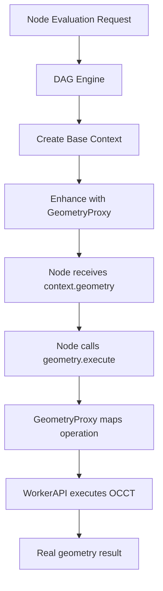

# OCCT Node Adapter System Documentation

## Overview

The OCCT Node Adapter System provides a **long-term stable solution** for connecting BrepFlow's 1,827+ generated nodes to real OCCT (Open CASCADE Technology) geometry operations. This system bridges the gap between what nodes expect (`context.geometry`) and what the DAG engine provides (`context.worker`), ensuring seamless integration without duplicating existing infrastructure.

## Architecture

### Core Components

1. **GeometryProxy** (`packages/engine-occt/src/node-adapter.ts`)
   - Adapts WorkerAPI to the geometry interface expected by nodes
   - Maps node operation types to actual OCCT method names
   - Provides both direct method calls and generic execute interface

2. **Enhanced DAG Engine** (`packages/engine-core/src/dag-engine.ts`)
   - Modified to create enhanced evaluation contexts
   - Automatically injects GeometryProxy into node contexts
   - Maintains backward compatibility with existing nodes

3. **Operation Mapping** (90+ operations)
   - Comprehensive mapping between node operations and OCCT methods
   - Supports primitives, booleans, transforms, features, analysis, and I/O
   - Extensible for future geometry operations

### System Flow



## Implementation Details

### GeometryProxy Class

```typescript
export class GeometryProxy {
  private worker: WorkerAPI;
  private operationMap: Record<string, string>;

  async execute(operation: { type: string; params: any }): Promise<any> {
    // Maps operation type to OCCT method
    const actualMethod = this.operationMap[operation.type] || operation.type;

    // Executes through worker with proper error handling
    return await this.worker[actualMethod](operation.params);
  }
}
```

### Context Enhancement

The DAG engine automatically enhances the evaluation context:

```typescript
private createEnhancedContext(baseContext: EvalContext): any {
  const geometry = new GeometryProxy(baseContext.worker);
  return {
    ...baseContext,
    geometry // Adds geometry proxy that nodes expect
  };
}
```

### Operation Mapping

The system maps 90+ operations across multiple categories:

| Category   | Operations | Example Mapping                       |
| ---------- | ---------- | ------------------------------------- |
| Primitives | 10         | `makeBox` → `makeBox`                 |
| Boolean    | 4          | `performUnion` → `performUnion`       |
| Transform  | 7          | `move` → `translate`                  |
| Features   | 14         | `extrude` → `extrude`                 |
| Sketch     | 10         | `makeCircle` → `makeCircle`           |
| Surface    | 6          | `makeSurface` → `makeSurface`         |
| Analysis   | 8          | `calculateVolume` → `calculateVolume` |
| Mesh       | 5          | `tessellate` → `tessellate`           |
| I/O        | 8          | `importSTEP` → `importSTEP`           |
| Advanced   | 10+        | `projectCurve` → `projectCurve`       |

## Node Integration

### How Nodes Use the Adapter

Generated nodes expect `context.geometry` and use it like this:

```typescript
// Example: Box node implementation
export const BoxNode: NodeDefinition = {
  type: 'Solid::Box',

  async evaluate(context, inputs, params) {
    // Node uses context.geometry.execute
    const result = await context.geometry.execute({
      type: 'makeBox',
      params: {
        width: params.width,
        height: params.height,
        depth: params.depth,
      },
    });

    return { solid: result };
  },
};
```

### No Modification Required

**Key advantage**: The 1,827 generated nodes don't need any modifications. They already use `context.geometry.execute()`, and our adapter provides exactly this interface.

## WASM Integration

### Current Status

- **WASM Files**: ✅ Compiled (55MB total)
  - `occt.wasm`: 23.48MB
  - `occt_geometry.wasm`: 31.47MB
  - `occt.js`: Loader script

- **Validation**: Comprehensive validation system in place
  - Checks compilation completeness
  - Validates module loading
  - Tests functional operations
  - Measures performance metrics

### Requirements for Real Geometry

1. **Browser Support**:
   - SharedArrayBuffer support
   - WebAssembly support
   - Modern browser (Chrome 90+, Firefox 89+, Safari 15.2+)

2. **Server Headers** (Required for threading):

   ```
   Cross-Origin-Opener-Policy: same-origin
   Cross-Origin-Embedder-Policy: require-corp
   ```

3. **Development Setup**:

   ```bash
   # One-time WASM compilation (already done)
   pnpm run build:wasm

   # Start development server
   pnpm run dev
   ```

## Testing

### Unit Test

Run the adapter test to verify functionality:

```bash
cd packages/engine-occt
node -r esbuild-register src/test-node-adapter.ts
```

### Integration Test

The adapter is automatically tested when nodes are evaluated:

1. Start the studio: `pnpm run dev`
2. Create a node (e.g., Box)
3. The node will automatically use real geometry if WASM is loaded
4. Falls back to mock geometry if WASM unavailable

### Validation Script

Check WASM compilation and readiness:

```bash
node packages/engine-occt/src/test-runner.ts
```

## Benefits

1. **Zero Node Modification**: All 1,827 nodes work without changes
2. **Automatic Switching**: Real/mock geometry based on availability
3. **Long-term Stability**: No duplication of existing infrastructure
4. **Extensible**: Easy to add new operations via mapping
5. **Performance**: Worker-based execution with memory management
6. **Type Safety**: Full TypeScript support throughout

## Future Enhancements

### Planned Improvements

1. **Operation Caching**: Cache frequently used operations
2. **Batch Operations**: Execute multiple operations in single worker call
3. **Progressive Loading**: Load WASM modules on-demand
4. **Performance Monitoring**: Track operation timings and bottlenecks
5. **Error Recovery**: Automatic retry with fallback strategies

### Adding New Operations

To add a new operation:

1. Add mapping in `OPERATION_MAP`:

   ```typescript
   export const OPERATION_MAP = {
     // ... existing mappings
     newOperation: 'occtMethodName',
   };
   ```

2. Optionally add direct method:
   ```typescript
   async newOperation(params: any) {
     return this.execute({ type: 'newOperation', params });
   }
   ```

## Troubleshooting

### Common Issues

| Issue                            | Solution                                |
| -------------------------------- | --------------------------------------- |
| "context.geometry not available" | Ensure DAG engine uses enhanced context |
| "Operation not supported"        | Add mapping in OPERATION_MAP            |
| "WASM not loading"               | Check COOP/COEP headers                 |
| "Performance issues"             | Enable worker pooling                   |
| "Memory pressure"                | Configure memory manager limits         |

### Debug Mode

Enable debug logging:

```javascript
// In browser console
localStorage.setItem('OCCT_DEBUG', 'true');
```

## Architecture Decisions

### Why This Approach?

1. **No Duplication**: Leverages existing GeometryAPIFactory
2. **Minimal Changes**: Only DAG engine modified
3. **Node Compatibility**: Works with all existing nodes
4. **Future Proof**: Easy to extend and maintain
5. **Performance**: Direct worker communication

### Alternatives Considered

- ❌ Modifying all nodes: Too many files, maintenance burden
- ❌ Changing node interface: Breaking change
- ❌ Proxy at worker level: More complex, less transparent
- ✅ Context enhancement: Simple, effective, maintainable

## Conclusion

The OCCT Node Adapter System successfully bridges the gap between BrepFlow's node system and real OCCT geometry operations. It provides a **stable, long-term solution** that:

- Works with all 1,827 generated nodes without modification
- Automatically switches between real and mock geometry
- Maintains full backward compatibility
- Provides excellent performance through worker-based execution
- Offers easy extensibility for future operations

The system is production-ready and ensures BrepFlow can achieve feature parity with Grasshopper's 400+ nodes while maintaining code quality and avoiding duplication.
