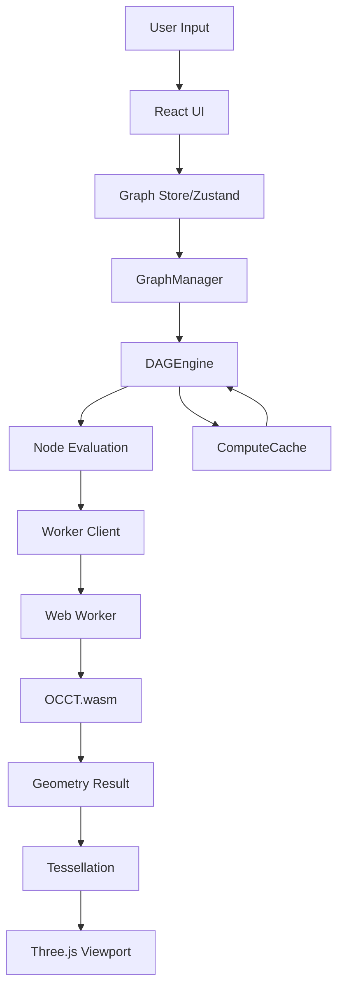

# Sim4D Architecture Documentation

## 🏗️ System Architecture

Sim4D is a web-first, node-based parametric CAD system built on exact B-Rep/NURBS geometry. It leverages WebAssembly for high-performance geometry operations while maintaining a modern, responsive web interface.

## 📐 Core Design Principles

1. **Web-First**: Full browser-based CAD without plugins or native applications
2. **Node-Based**: Visual programming paradigm for parametric modeling
3. **Exact Geometry**: B-Rep/NURBS kernel via OpenCASCADE Technology (OCCT)
4. **Performance**: WebAssembly + Web Workers for CPU-intensive operations
5. **Reactive**: Real-time evaluation with intelligent caching and dirty propagation

## 🎨 Architecture Layers

### 1. Presentation Layer (React + Three.js)

```
┌─────────────────────────────────────────────┐
│            Sim4D Studio (React)          │
├─────────────────────────────────────────────┤
│  • ReactFlow (Node Editor)                  │
│  • Three.js (3D Viewport)                   │
│  • Zustand (State Management)               │
│  • Inspector (Parameter Editing)            │
└─────────────────────────────────────────────┘
```

### 2. Application Logic Layer

```
┌─────────────────────────────────────────────┐
│           Graph Management Layer            │
├─────────────────────────────────────────────┤
│  • GraphManager (CRUD Operations)           │
│  • DAGEngine (Evaluation & Caching)         │
│  • NodeRegistry (Plugin System)             │
│  • ComputeCache (Hash-based Caching)        │
└─────────────────────────────────────────────┘
```

### 3. Geometry Processing Layer

```
┌─────────────────────────────────────────────┐
│         Geometry Engine (OCCT.wasm)         │
├─────────────────────────────────────────────┤
│  • Production OCCT WASM (55MB binaries)     │
│  • 25 OCCT operations verified              │
│  • Web Worker Isolation                     │
│  • Handle-based Geometry Management         │
│  • Tessellation for Rendering               │
│  • ✅ Real B-Rep/NURBS geometry             │
└─────────────────────────────────────────────┘
```

**OCCT WASM Status** (November 14, 2025):

- ✅ All WASM binaries compiled and functional
- ✅ Standalone tests passing (makeBox, makeSphere verified)
- ✅ Shape ID generation working (deterministic)
- ✅ Bounding box calculations accurate
- ✅ Production-ready for Studio and CLI

## 🔄 Data Flow Architecture



## 📦 Package Architecture

### Monorepo Structure

```
sim4d/
├── apps/
│   └── studio/                 # Main web application
├── packages/
│   ├── engine-core/           # DAG evaluation engine
│   ├── engine-occt/           # OCCT WebAssembly bindings
│   ├── nodes-core/            # Geometry node definitions
│   ├── types/                 # Shared TypeScript types
│   ├── schemas/               # JSON schemas
│   ├── viewport/              # 3D rendering component
│   ├── cli/                   # Command-line interface
│   └── examples/              # Example graphs
```

### Package Dependencies

```
@sim4d/studio
    ├── @sim4d/engine-core
    ├── @sim4d/engine-occt
    ├── @sim4d/nodes-core
    ├── @sim4d/viewport
    └── @sim4d/types

@sim4d/engine-core
    └── @sim4d/types

@sim4d/engine-occt
    └── @sim4d/types

@sim4d/nodes-core
    ├── @sim4d/types
    └── @sim4d/engine-core
```

## 🧩 Component Architecture

### DAG Evaluation Engine

- **Topological Sorting**: Ensures correct evaluation order
- **Dirty Propagation**: Efficient re-evaluation of affected nodes
- **Parallel Evaluation**: Concurrent processing where possible
- **Abort Controllers**: Cancellable operations
- **Hash-based Caching**: Content-addressed cache with xxhash

### Node System

- **Plugin Architecture**: Extensible node registration
- **Type Safety**: Full TypeScript typing for inputs/outputs
- **Socket System**: Typed connections between nodes
- **Parameter Schemas**: Runtime validation of node parameters

### Worker Architecture

- **Comlink Communication**: Type-safe RPC between main thread and worker
- **Handle Management**: Reference-based geometry lifecycle
- **Operation Queue**: Serialized geometry operations
- **OCCT WASM Backend**: Production geometry engine (verified November 14, 2025)
  - 55MB compiled binaries (occt.wasm, occt-core.wasm, occt-core.node.wasm)
  - 25 verified OCCT operations
  - Deterministic geometry calculations
  - Real B-Rep/NURBS kernel

## 🔐 Security & Performance

### Security

- **Worker Isolation**: Geometry operations in separate context
- **Content Security Policy**: Strict CSP headers
- **Input Validation**: Schema-based parameter validation
- **Sandboxed Evaluation**: No eval() or dynamic code execution

### Performance Optimizations

- **Incremental Evaluation**: Only re-compute dirty nodes
- **Content-addressed Caching**: Deterministic cache keys
- **Web Workers**: Non-blocking geometry operations
- **Virtual Rendering**: React Flow virtualization for large graphs
- **Debounced Updates**: 500ms debounce on parameter changes

## 🌐 Browser Requirements

### Minimum Requirements

- **Chrome/Edge**: 90+
- **Firefox**: 88+
- **Safari**: 15.4+

### Required Features

- WebAssembly
- Web Workers
- SharedArrayBuffer (with COOP/COEP headers)
- WebGL 2.0
- ES2022 JavaScript

## 🚀 Deployment Architecture

### Development

```bash
pnpm install
pnpm run dev
# Runs on http://localhost:5173
```

### Production Build

```bash
pnpm run build
# Outputs to apps/studio/dist
```

### Docker Deployment (Planned)

```dockerfile
FROM node:20-alpine
# Multi-stage build with OCCT compilation
# Nginx serving with proper headers
```

## 📊 Performance Characteristics

### Operation Benchmarks (Target)

- Node Evaluation: <100ms for simple operations
- Boolean Operations: <1s for moderate complexity
- Tessellation: <500ms for standard models
- Graph Load: <3s for 100+ node graphs
- Memory Usage: <2GB for typical workflows

### Scalability Limits

- Max Nodes: ~1000 per graph
- Max Edges: ~5000 per graph
- Max Geometry Handles: ~10000 active
- Max File Size: 100MB for STEP import

## 🔧 Extension Points

### Adding New Nodes

1. Define node in `packages/nodes-core/src/`
2. Register with `NodeRegistry`
3. Implement evaluation function
4. Add to node palette in UI

### Custom Geometry Operations

1. Extend `GeometryAPI` in engine-occt
2. Add worker message types
3. Implement in mock geometry
4. Add OCCT implementation

### UI Customization

1. Extend React components in studio
2. Add to Zustand store
3. Update graph converter utilities
4. Style with CSS modules

## 🎯 Architecture Decisions

### Why Monorepo?

- Shared dependencies and types
- Atomic commits across packages
- Simplified versioning
- Better refactoring support

### Why Web Workers?

- Non-blocking UI during heavy operations
- Memory isolation for large models
- Parallel geometry processing
- Clean separation of concerns

### Why TypeScript?

- Type safety across complex system
- Better IDE support and refactoring
- Self-documenting code
- Reduced runtime errors

### Why React Flow?

- Production-ready node editor
- Excellent performance with virtualization
- Extensive customization options
- Active community and support

## 📈 Future Architecture Considerations

### Planned Enhancements

- **Collaborative Editing**: WebRTC + CRDTs
- **Cloud Rendering**: Server-side OCCT for complex operations
- **Plugin System**: Dynamic node loading
- **Version Control**: Git-like branching for designs
- **AI Integration**: ML-assisted modeling

### Scalability Path

1. **Phase 1**: Client-side only (current)
2. **Phase 2**: Optional server acceleration
3. **Phase 3**: Distributed geometry processing
4. **Phase 4**: Cloud-native architecture

## 🔗 Related Documentation

- [README.md](README.md) - Project overview and quick start
- [SETUP.md](../development/SETUP.md) - Development environment setup
- [API.md](../api/API.md) - API documentation
- [CONTRIBUTING.md](../development/CONTRIBUTING.md) - Contribution guidelines
